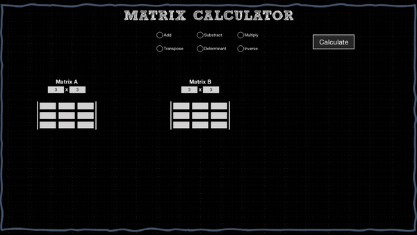
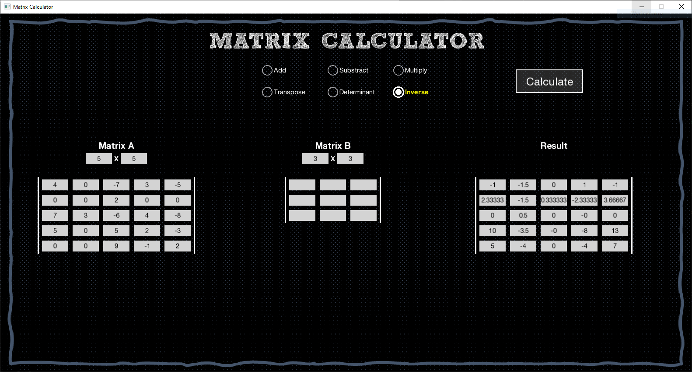

# Matrix Calculator
## Sections

 - [Visuals](#visuals)
 - [Description](#description)
	 - [General](#general)
	 - [Programming languages and libriaries](#programming-languages-and-libraries)
	 - [Main features](#main-features)
 - [Usage](#usage)
 - [To do](#to-do)

## Visuals

## Description

### General

This application allows the user to do operations on matrices. There are 6 operations: addition, substraction, multiplication, transposition, calculating a determinant and inversion. There is a possibility of changing the dimensions of matrices and each value of a matrix.  
I created this project because I wanted to implement Laplace expansion algorithm which is used to calculate a determinant of a matrix. Doing it was a lot of fun.

### Programming languages and libraries

 - C++ (OOP, Polymorphism, STL)
 - SFML

### Main features

- Matrix operations
- Ability to change dimensions of matrices
- Wrong values indication

## Usage

 - Improving knowledge about matrices and algorithms
 - Matrix calculations

## To do
Few things are left to implement:
- Value of a determinant is printed in a console instead on the window,
- hide Matrix B when doing operations which need only Matrix A.
